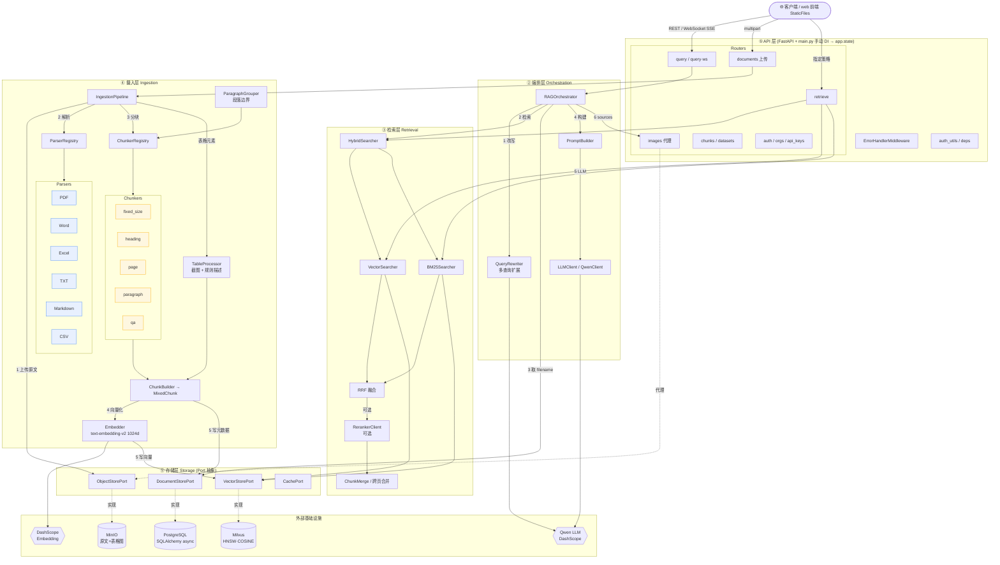

# 系统整体架构图

> 五层架构（API → 编排 → 检索 → 摄入 → 存储），每层单一职责、节点可独立替换（Pipeline 设计）。

## 读图说明

### 两条主数据流

- **摄入流（蓝）**：`documents` 上传 → `IngestionPipeline` → 解析 → 分块（含表格截图/描述）→ `MixedChunk` → Embedding → 写 Milvus + PG + MinIO
- **查询流（绿）**：`query/ws` → `RAGOrchestrator` → 改写 → 混合检索 → RRF（可选 Reranker）→ Prompt → Qwen 流式生成 → 代理图片 URL 返回

### 各层职责

| 层 | 职责 | 关键组件 |
|----|------|---------|
| ① API | FastAPI REST/WebSocket，手动 DI | Routers、ErrorHandlerMiddleware |
| ② 编排 | 串联检索 → Prompt → LLM → 响应，SSE 流式 | RAGOrchestrator、QueryRewriter、PromptBuilder |
| ③ 检索 | 向量 + BM25 混合，RRF 融合，可选 Reranker | HybridSearcher、VectorSearcher、BM25Searcher |
| ④ 摄入 | 解析 → 分块 → 向量化 → 写库 | IngestionPipeline、ParserRegistry、ChunkerRegistry |
| ⑤ 存储 | Port 抽象解耦实现 | VectorStorePort、DocumentStorePort、ObjectStorePort |

### 设计要点

- **Port 抽象**：`VectorStorePort / DocumentStorePort / ObjectStorePort / CachePort` 解耦业务与存储实现（图中虚线「实现」绑定）
- **MixedChunk**：单 chunk 可交错文本与表格元素，`full_text` 参与向量化，`image_url` 仅存储截图、不进 LLM Prompt
- **图片代理**：所有 `image_url` 经 `/api/v1/images/{path}` 代理，内部 MinIO 路径不外泄
- **Chunk ID**：`{doc_id}_p{page}_c{chunk_index}`
- **Pipeline 设计**：检索/摄入各节点独立可替换（如换 Embedding 模型、换向量库实现）

### 相关文档

- `docs/RAG系统设计文档.md` — 系统设计（架构、数据流、选型）
- `docs/分块策略实现机制.md` — 分块策略详解
- `docs/知识检索机制.md` — 检索机制详解
